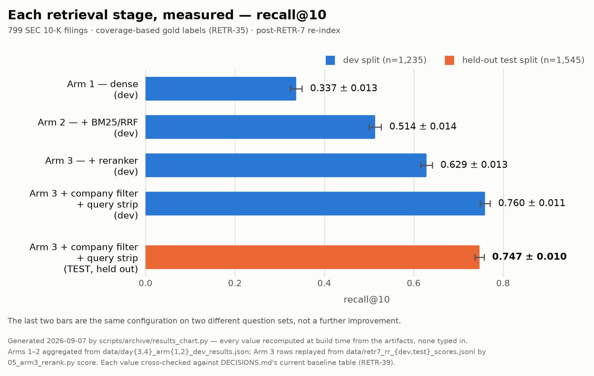

# RAG-SEC

Retrieval-augmented QA over SEC 10-K filings. A learning project measuring, arm
by arm, how much each retrieval technique (dense embeddings, hybrid BM25 fusion,
cross-encoder reranking) actually moves accuracy — not assumed, measured.

## Result

Best arm, on the **held-out test split** — dense + BM25/RRF + `bge-reranker-v2-m3`,
scored under the coverage-based gold labels (`DECISIONS.md` RETR-35):

| Cell | recall@10 |
|---|---|
| reranked baseline | 0.604 |
| + company filter | 0.644 |
| + query strip | 0.625 |
| **+ both** | **0.752** |

The two together are worth 2.4x their sum: once every candidate is the right company, the
company name in the query only rewards whichever chunk repeats the most boilerplate.

Every arm is scored on the same 799-filing corpus, same split, same labels. Full
methodology and every design decision (why this chunk size, why this fusion method, what
broke and how) is logged in [`DECISIONS.md`](DECISIONS.md).



⚠️ The chart above predates RETR-35's label correction and its numbers are **not**
comparable to the table — recall is uniformly higher under the corrected labels. It has no
producer script, so it cannot be regenerated; the table is the number to quote.

## Pipeline

```
INGEST                                  QUERY
EDGAR filings (.htm)                    question
      │  edgar.py                             │  company.py   (company filter + query strip)
      ▼                                       ▼
parsed sections (.json)                 retrieve.py   (dense + BM25/RRF + bge-reranker-v2-m3)
      │  parsing.py  (sec-parser)             │
      ▼                                       ├──►  eval.py        recall@k, nDCG@k, MRR
chunks (.json)                                │
      │  chunking.py                          └──►  compress.py    (DSLR slice packing)
      ▼                                                  │
embeddings + BM25 index                                  ▼
      │  store.py                              answer_eval.py, agent.py  (LangGraph, parked)
      ▼
Postgres (pgvector + pg_search)  ◄── read by retrieve.py

Every module above is under src/rag_sec/.
```

Eval set: [T²-RAGBench](https://huggingface.co/datasets/G4KMU/t2-ragbench)
(FinQA + ConvFinQA subsets, 799 unique filings).

## Setup

Requires [`uv`](https://docs.astral.sh/uv/) and Docker.

```bash
cp .env.example .env        # fill in POSTGRES_PASSWORD and EDGAR_CONTACT_EMAIL
docker compose up -d        # Postgres 18 + pgvector + pg_search (BM25)
uv sync
```

## Regenerating the data

The corpus (filings, parsed sections, chunks, embeddings, rerank scores) isn't
committed — it's ~4GB and fully reproducible from EDGAR. Rebuild it in order:

```bash
uv run scripts/corpus/build_corpus.py    # fetch all 799 filings from EDGAR, parse, chunk (~1h)
uv run scripts/index/embed_local.py      # embed + load into Postgres
uv run scripts/index/index_bm25.py       # build BM25 index (pg_search)
```

`build_corpus.py` skips whatever is already on disk, so it resumes after an interruption
and re-running it is a no-op. After changing `chunking.py` or `parsing.py`, rebuild without
re-downloading:

```bash
uv run scripts/corpus/build_corpus.py --rechunk   # re-chunk from data/parsed/ (~4 min)
uv run scripts/corpus/build_corpus.py --reparse   # re-parse from data/filings/ (~30 min)
```

Reranking (Arm 3) needs a CUDA GPU — on a CPU it doesn't finish in reasonable
time (see `DECISIONS.md` ARM3-2). The split-job scripts in `scripts/retrieval/`
(`rerank_prepare.py` → run `rerank_hpc.py` on a GPU box → `rerank_score.py`) exist
for that; adapt the GPU step to whatever cluster or cloud GPU you have.
Corpus-growth embeddings follow the same split-job pattern in `scripts/index/`
(`embed_prepare.py` → `embed_hpc.py` → `embed_load.py`).

## Running the eval

```bash
uv run scripts/retrieval/arm1_dense.py         # dense only
uv run scripts/retrieval/arm2_hybrid.py        # + BM25 / RRF fusion
uv run scripts/archive/arm3_singleprocess.py   # + reranker (archived single-machine reference; slow on CPU, use -n for a quick check)
```

The recorded Arm 3 baseline was produced by the split-job pipeline instead
(`scripts/archive/arm3_rerank_prepare.py` → `arm3_rerank_hpc.py` on a GPU box →
`arm3_rerank_score.py`) — see `DECISIONS.md` ARM3-2 for why a full CPU run isn't
viable. Those three are archived; the current split-job trio is
`scripts/retrieval/rerank_{prepare,hpc,score}.py`.

## Docs

- [`spec.md`](spec.md) — scope, sequence, eval methodology (source of truth)
- [`DECISIONS.md`](DECISIONS.md) — every design choice, why kept or dropped
- [`SESSION.md`](SESSION.md) — what's next and what's blocked
- [`INVENTORY.md`](INVENTORY.md) — file-by-file map: what each file is and whether it's still needed
- [`RUNBOOK.md`](RUNBOOK.md) — how to run a GPU job on the cluster, start to finish
- `CLAUDE.md` (local, gitignored) — working rules + current project state
